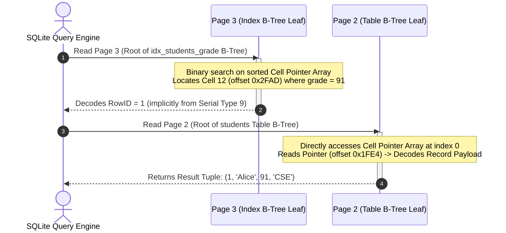

# Byte-Level Anatomy of SQLite3 B-Trees: Hex Dump & Storage Analysis

## 1. Laboratory Objectives

This laboratory experiment explores the low-level physical storage representation of a Relational Database Management System (RDBMS) by dissecting a **SQLite3** database file. Using a byte-level hexadecimal dump generated with `xxd`, we will unpack the internal mechanics of:
* **SQLite Page Framework**: Understanding how fixed-size pages partition disk space.
* **B-Tree Page Anatomy**: Deciphering leaf/interior page structures, B-tree headers, and segment offsets.
* **Cell Pointer Arrays**: Examining how SQLite achieves high-performance $O(\log N)$ binary search lookups inside variable-length records.
* **Compact Record Serialization**: Tracking varints, serial type headers, and data payload compression schemas.
* **Platform-Specific Memory Padding**: Investigating the macOS-specific page-end reservation alignment.

---

## 2. Experimental Database Setup

To generate a predictable, defragmented, and fully analyzed physical structure, the following SQL script was compiled into a fresh SQLite3 database. The script creates a schema, inserts a diverse dataset of 15 student records, constructs a secondary index on numerical grades, and performs a `VACUUM` to guarantee that all allocated records are tightly packed and physically sequential.

### Database Schema & Insertion Script (`create_campus.sql`)
```sql
-- Table representing students in different engineering branches
CREATE TABLE students (
    id INTEGER PRIMARY KEY,
    name TEXT NOT NULL,
    grade INTEGER,
    department TEXT
);

-- Secondary index on the 'grade' column for B-tree index analysis
CREATE INDEX idx_students_grade
ON students(grade);

-- Seeding sample data (15 records)
INSERT INTO students (name, grade, department) VALUES
('Alice', 91, 'CSE'),
('Bob', 85, 'ISE'),
('Carol', 88, 'ECE'),
('David', 76, 'ME'),
('Eva', 95, 'CSE'),
('Frank', 82, 'EEE'),
('Grace', 89, 'ISE'),
('Helen', 92, 'ECE'),
('Ian', 80, 'CSE'),
('Jack', 87, 'ME'),
('Kevin', 78, 'EEE'),
('Luna', 90, 'CSE'),
('Mia', 84, 'ISE'),
('Noah', 93, 'ECE'),
('Olivia', 86, 'ME');

-- Defragment, sort, and compact B-Tree allocations sequentially on disk
VACUUM;
```

### Execution & Hex Dump Generation Commands
To build the database and generate the byte-level hex dump, execute the following shell commands in your terminal:
```bash
# 1. Compile the database from the SQL script
sqlite3 "lab 4/campus.db" < "lab 4/create_campus.sql"

# 2. Extract database high-level statistics and integrity info
sqlite3 "lab 4/campus.db" ".dbinfo"

# 3. List schemas and root page definitions
sqlite3 "lab 4/campus.db" "SELECT type, name, rootpage, sql FROM sqlite_schema;"

# 4. Generate the byte-level hexadecimal dump (1-byte grouping)
xxd -g 1 "lab 4/campus.db" > "lab 4/campus.hex"
```

---

## 3. Physical Storage Architecture

SQLite divides its database file into homogeneous, fixed-size physical blocks called **Pages**. By default, modern SQLite builds use **4096-byte** pages, mirroring standard operating system filesystem block sizes to minimize disk I/O latency.

Any absolute file offset can be mapped directly to a page number using the formula:
$$\text{File Offset} = (\text{Page Number} - 1) \times 4096$$

| Page Number | File Offset Range | Logical Classification | Component Description |
| :---: | :---: | :---: | :--- |
| **Page 1** | `0x0000 - 0x0FFF` | **System/Schema Table** | Database File Header & Schema Metadata B-Tree (`sqlite_schema`) |
| **Page 2** | `0x1000 - 0x1FFF` | **Table Leaf Page** | Clustered Primary B-Tree Leaf Page containing `students` data payloads |
| **Page 3** | `0x2000 - 0x2FFF` | **Index Leaf Page** | Secondary B-Tree Leaf Page containing sorted index entries (`idx_students_grade`) |

> [!IMPORTANT]
> **macOS Platform Padding Default**
> Under default system compilations on macOS, SQLite reserves **12 bytes** at the absolute end of each page for system-level encryption, locking, or extension metadata. Consequently, the actual usable block size per page shrinks from $4096$ to $4084$ bytes. This structural alignment is visible in the hex dump at the end of each $4\text{KB}$ page boundary.

---

## 4. Dissecting the SQLite File Header

The first **100 bytes** of Page 1 (offset `0x0000` to `0x0063`) define the global metadata header of the database. Below is the raw hex representation followed by the byte-by-byte semantic decoding.

```text
00000000: 53 51 4c 69 74 65 20 66 6f 72 6d 61 74 20 33 00  SQLite format 3.
00000010: 10 00 01 01 0c 40 20 20 00 00 00 04 00 00 00 03  .....@  ........
00000020: 00 00 00 00 00 00 00 00 00 00 00 03 00 00 00 04  ................
00000030: 00 00 00 00 00 00 00 00 00 00 00 01 00 00 00 00  ................
```

### Deep Dive: Decoded Header Fields

| Byte Offset | Hex Bytes | Decoded Value | Field Description & Architectural Meaning |
| :---: | :--- | :---: | :--- |
| `0x00 - 0x0F` | `53 51 4c 69 74 65 20 66 6f 72 6d 61 74 20 33 00` | `"SQLite format 3\0"` | **Magic Header Signature**: Identifies the file type. |
| `0x10 - 0x11` | `10 00` | `4096` | **Database Page Size**: Explicitly defines the block size in bytes (`0x1000` = 4096). |
| `0x12` | `01` | `1` | **Write Version**: Legacy file format write version (1 = Journal mode, 2 = WAL mode). |
| `0x13` | `01` | `1` | **Read Version**: Legacy file format read version (1 = Journal mode, 2 = WAL mode). |
| `0x14` | `0c` | `12` | **Reserved Space**: Bytes of metadata reserved at the end of each page (macOS padding). |
| `0x15` | `40` | `64` | **Max Payload Fraction**: Maximum embedded payload fraction (must be 64). |
| `0x16` | `20` | `32` | **Min Payload Fraction**: Minimum embedded payload fraction (must be 32). |
| `0x17` | `20` | `32` | **Leaf Payload Fraction**: Leaf payload fraction (must be 32). |
| `0x18 - 0x1B` | `00 00 00 04` | `4` | **File Change Counter**: Incremented on transactional database modifications. |
| `0x1C - 0x1F` | `00 00 00 03` | `3` | **In-Header Database Size**: Total size of the database file measured in pages. |
| `0x38 - 0x3B` | `00 00 00 01` | `1` | **Text Encoding**: Database encoding (1 = UTF-8, 2 = UTF-16le, 3 = UTF-16be). |

---

## 5. SQLite B-Tree Page Classifications

The classification of any SQLite page representing a B-tree structure (table or index) is declared in its B-tree Page Header by a single flag byte:

```
                  +-----------------------------------+
                  |        B-Tree Page Flags          |
                  +-----------------------------------+
                                    |
           +------------------------+------------------------+
           |                                                 |
  [ Table Page Types ]                              [ Index Page Types ]
     |            |                                    |            |
(Interior)      (Leaf)                              (Interior)    (Leaf)
  [0x05]        [0x0D]                                [0x02]      [0x0A]
```

* **`0x0D` (13)**: **Table Leaf Page** — Contains data record payloads mapped directly to integer keys (RowIDs).
* **`0x0A` (10)**: **Index Leaf Page** — Contains sorted index entries (column keys + target RowIDs).
* **`0x05` (5)**: **Table Interior Page** — Contains navigation key/pointer pairs to traverse child pages.
* **`0x02` (2)**: **Index Interior Page** — Contains sorted keys and navigation pointers for index traversal.

---

## 6. Page 1 Analysis — The Schema Table (`sqlite_schema`)

Page 1 serves a dual role: it contains the 100-byte global file header and immediately acts as the root of the database schema B-tree. The **B-tree Page Header** for the schema table starts at byte offset 100 (`0x0064`).

```text
00000060: 00 2e 8d f8 0d 00 00 00 02 0f 06 00 0f 60 0f 06  .............`..
                      ^^ Header Starts at 0x64
```

### B-Tree Page Header Decoded (`0x0064 - 0x006B`)
* **Page Type Flag (`0x64`)**: `0d` $\rightarrow$ Indicates a **Table Leaf Page**.
* **First Freeblock (`0x65 - 0x66`)**: `00 00` $\rightarrow$ 0 (No fragmented free blocks present).
* **Cell Count (`0x67 - 0x68`)**: `00 02` $\rightarrow$ Exactly **2 cells** are present (one for the table `students`, one for the index `idx_students_grade`).
* **Start of Cell Content Area (`0x69 - 0x6A`)**: `0f 06` $\rightarrow$ First byte of cell data payload starts at page offset `0x0F06`.
* **Fragmented Free Bytes (`0x6B`)**: `00` $\rightarrow$ 0 bytes of fragmented memory.

### Cell Pointer Array (`0x006C - 0x006F`)
The cell pointers are stored directly after the page header. Since there are 2 cells, we have two 2-byte pointers containing the offsets to their respective payloads:
1. **Cell 0 Offset**: `0f 60` $\rightarrow$ Pointer points to offset `0x0F60`.
2. **Cell 1 Offset**: `0f 06` $\rightarrow$ Pointer points to offset `0x0F06`.

---

### Step-by-Step Cell Payload Decoding

#### Cell 0: Table `students` Schema Entry (Offset `0x0F60`)
```text
00000f60: 81 11 01 07 17 1d 1d 01 81 75 74 61 62 6c 65 73  .........utables
00000f70: 74 75 64 65 6e 74 73 73 74 75 64 65 6e 74 73 02  tudentsstudents.
00000f80: 43 52 45 41 54 45 20 54 41 42 4c 45 20 73 74 75  CREATE TABLE stu...
```

1. **Payload Size**: Stored as a SQLite variable-length integer (varint). 
   * Hex bytes: `81 11`
   * Byte 1 (`0x81`): The MSB is set ($129 \ge 128$), meaning the varint continues to the next byte. Useful bits: `0x81 & 0x7F = 0x01`.
   * Byte 2 (`0x11`): The MSB is 0, ending the varint. Useful bits: `0x11`.
   * Decoding: $(0x01 \ll 7) \mid 0x11 = 128 + 17 = 145$ bytes.
2. **RowID**: Stored as varint `01` $\rightarrow$ RowID = 1.
3. **Record Header Size**: Varint `07` $\rightarrow$ 7 bytes.
4. **Serial Types Array (6 bytes total after Header Size)**:
   * `17` $\rightarrow$ Text value. Length: $(23 - 13) / 2 = 5$ bytes (`type` = `"table"`).
   - `1d` $\rightarrow$ Text value. Length: $(29 - 13) / 2 = 8$ bytes (`name` = `"students"`).
   - `1d` $\rightarrow$ Text value. Length: $(29 - 13) / 2 = 8$ bytes (`tbl_name` = `"students"`).
   - `01` $\rightarrow$ 8-bit signed integer. Length: 1 byte (`rootpage` = 2).
   - `81 75` $\rightarrow$ Varint serial type. Decodes to $(0x01 \ll 7) \mid 0x75 = 245$. This is a Text column. Length: $(245 - 13) / 2 = 116$ bytes (`sql` = `"CREATE TABLE students..."`).
5. **Data Values Partition**:
   - `74 61 62 6c 65` $\rightarrow$ `"table"`
   - `73 74 75 64 65 6e 74 73` $\rightarrow$ `"students"`
   - `73 74 75 64 65 6e 74 73` $\rightarrow$ `"students"`
   - `02` $\rightarrow$ Root page integer 2.
   - `43 52 45 ...` $\rightarrow$ `"CREATE TABLE students ( ... )"`

---

#### Cell 1: Index `idx_students_grade` Schema Entry (Offset `0x0F06`)
```text
00000f00: 00 00 00 00 00 00 58 02 06 17 31 1d 01 71 69 6e  ......X...1..qin
                            ^^ Start of Cell Payload
```

1. **Payload Size**: Varint `58` $\rightarrow$ 88 bytes.
2. **RowID**: Varint `02` $\rightarrow$ RowID = 2.
3. **Record Header Size**: Varint `06` $\rightarrow$ 6 bytes.
4. **Serial Types**:
   - `17` $\rightarrow$ Text of $(23-13)/2 = 5$ bytes (`type` = `"index"`).
   - `31` $\rightarrow$ Text of $(49-13)/2 = 18$ bytes (`name` = `"idx_students_grade"`).
   - `1d` $\rightarrow$ Text of $(29-13)/2 = 8$ bytes (`tbl_name` = `"students"`).
   - `01` $\rightarrow$ 8-bit signed integer (`rootpage` = 3).
   - `71` $\rightarrow$ Text of $(113-13)/2 = 50$ bytes (`sql` = `"CREATE INDEX idx_students_grade ON students(grade)"`).
5. **Data Values Partition**:
   - `69 6e 64 65 78` $\rightarrow$ `"index"`
   - `69 64 78 5f ...` $\rightarrow$ `"idx_students_grade"`
   - `73 74 75 ...` $\rightarrow$ `"students"`
   - `03` $\rightarrow$ Root page integer 3.
   - `43 52 ...` $\rightarrow$ `"CREATE INDEX idx_students_grade ON students(grade)"`

---

## 7. Page 2 Analysis — The `students` Data B-Tree

Page 2 stores the table records for `students`, acting as the leaf page of our clustered primary B-tree. It resides at file offset `0x1000`.

### B-Tree Page Header Decoded (`0x1000 - 0x1007`)
```text
00001000: 0d 00 00 00 0f 0f 11 00
```
* **Page Type (`0x1000`)**: `0d` $\rightarrow$ **Table Leaf Page**.
* **Cell Count (`0x1003 - 0x1004`)**: `00 0f` $\rightarrow$ Exactly **15 cells** (corresponding to the 15 student records inserted).
* **Start of Cell Content Area (`0x1005 - 0x1006`)**: `0f 11` $\rightarrow$ Allocation of cell records starts bottom-up from offset `0x0F11`.

### Cell Pointer Array (`0x1008 - 0x1025`)
This section contains 15 pointers (2-byte offsets), sorted in ascending order of their primary key RowID.
Pointers are: `0f e4`, `0f d6`, `0f c6`, `0f b7`, `0f a9`, `0f 99`, `0f 89`, `0f 79`, `0f 6b`, `0f 5d`, `0f 4d`, `0f 3e`, `0f 30`, `0f 21`, `0f 11`.

### Logical Anatomy of Page 2 Layout
The page structure maps out with pointers growing downwards and payloads stacking upwards:

```
+--------------------------------------------------------+
| Page 2 Header (8 bytes: [0x1000 - 0x1007])             |
+--------------------------------------------------------+
| Cell Pointer Array (30 bytes, 15 entries)              |
| [0x0FE4] -> [0x0FD6] -> ... -> [0x0F11]                |
+--------------------------------------------------------+
|                                                        |
|             UNALLOCATED CONTIGUOUS SPACE               |
|             (Available for future insertions)          |
|                                                        |
+--------------------------------------------------------+
| Cells / Records Payload Area (Growing Bottom-Up)       |
| [Offset 0x1F11] Cell 14 (Olivia - RowID 15)            |
| ...                                                    |
| [Offset 0x1FD6] Cell 1  (Bob - RowID 2)                |
| [Offset 0x1FE4] Cell 0  (Alice - RowID 1)              |
+--------------------------------------------------------+
| Reserved macOS Padding Space (12 bytes)                |
+--------------------------------------------------------+
```

---

### record-level Analysis: Alice (RowID 1)
Located at page offset `0x0FE4` (file offset `0x1FE4`):
```text
00001fe0: 55 49 53 45 0e 01 05 00 17 01 13 41 6c 69 63 65  UISE.......Alice
00001ff0: 5b 43 53 45 00 00 00 00 00 00 00 00 00 00 00 00  [CSE............
                      ^^ Cell 0 Starts Here
```

1. **Payload Size (`0x1FE4`)**: `0e` $\rightarrow$ 14 bytes of payload.
2. **RowID (`0x1FE5`)**: `01` $\rightarrow$ RowID = 1.
3. **Payload Header Size (`0x1FE6`)**: `05` $\rightarrow$ 5 bytes of record header.
4. **Column Serial Types Array (`0x1FE7 - 0x1FEA`)**:
   * `00` $\rightarrow$ Column 1 (`id`). Since `id` is an `INTEGER PRIMARY KEY`, SQLite aliases it to the RowID. Storing the key twice would waste storage, so its serial type inside the record is set to `0` (NULL), taking **0 bytes** of payload space.
   * `17` $\rightarrow$ Column 2 (`name`). Text value of size: $(23 - 13) / 2 = 5$ bytes.
   - `01` $\rightarrow$ Column 3 (`grade`). 8-bit signed integer. Takes **1 byte**.
   - `13` $\rightarrow$ Column 4 (`department`). Text value of size: $(19 - 13) / 2 = 3$ bytes.
5. **Record Values Partition (`0x1FEB - 0x1FF3`)**:
   - `41 6c 69 63 65` $\rightarrow$ `"Alice"` (5 bytes)
   - `5b` $\rightarrow$ `91` in decimal (1 byte, `0x5b` = 91).
   - `43 53 45` $\rightarrow$ `"CSE"` (3 bytes)

---

## 8. Page 3 Analysis — The `idx_students_grade` Index B-Tree

Page 3 contains the secondary index B-tree created on the `grade` column. It begins at file offset `0x2000`.

### B-Tree Page Header Decoded (`0x2000 - 0x2007`)
```text
00002000: 0a 00 00 00 0f 0f 9b 00
```
* **Page Type (`0x2000`)**: `0a` $\rightarrow$ **Index Leaf Page**.
* **Cell Count (`0x2003 - 0x2004`)**: `00 0f` $\rightarrow$ Exactly **15 index records** are present.
* **Start of Cell Content Area (`0x2005 - 0x2006`)**: `0f 9b` $\rightarrow$ Free space boundary begins at page offset `0x0F9B`.

### Cell Pointer Array (`0x2008 - 0x2025`)
Unlike the table B-tree (which sorts keys by RowID), the index B-tree sorts records in **ascending order of the indexed value** (`grade` ASC, then `id` ASC to resolve duplicates).
Sorted pointers: `0f ee`, `0f e8`, `0f e2`, `0f dc`, `0f d6`, `0f d0`, `0f ca`, `0f c4`, `0f be`, `0f b8`, `0f b2`, `0f ad`, `0f a7`, `0f a1`, `0f 9b`.

---

### Record Decoding

#### Cell 0: Grade = 76 (David, RowID 4)
Located at page offset `0x0FEE` (file offset `0x2FEE`):
```text
00002fe0: 52 06 05 03 01 01 50 09 05 03 01 01 4e 0b 05 03  R.....P.....N...
                                            ^^ Cell 0 Payload Starts Here
```
1. **Payload Size (`0x2FEE`)**: `05` $\rightarrow$ 5 bytes.
2. **Record Header Size (`0x2FEF`)**: `03` $\rightarrow$ 3 bytes.
3. **Serial Types**:
   - `01` $\rightarrow$ 8-bit signed integer (grade column).
   - `01` $\rightarrow$ 8-bit signed integer (RowID key).
4. **Data Values**:
   - `4c` $\rightarrow$ Grade value: `76` (since `0x4C` = 76).
   - `04` $\rightarrow$ RowID: `4`.

---

#### Cell 12: Grade = 91 (Alice, RowID 1) — Special Serial Type 9 Optimization
Located at page offset `0x0FAD` (file offset `0x2FAD`):
```text
00002fa0: 05 05 03 01 01 5d 0e 05 03 01 01 5c 08 04 03 01  .....].....\....
                                               ^^ Cell 12 Payload Starts Here
00002fb0: 09 5b 05 ...
```
1. **Payload Size (`0x2FAD`)**: `04` $\rightarrow$ **4 bytes** (1 byte smaller than Cell 0!).
2. **Record Header Size (`0x2FAE`)**: `03` $\rightarrow$ 3 bytes.
3. **Serial Types (`0x2FAF - 0x2FB0`)**:
   - `01` $\rightarrow$ 8-bit signed integer (grade).
   - `09` $\rightarrow$ RowID key serial type.

> [!IMPORTANT]
> **Serial Type 9 Optimization**
> According to the SQLite record specification, a serial type of **`9`** signifies that the value is the constant integer **`1`**. The engine encodes this value directly inside the schema header array, requiring **0 bytes** of actual data payload. This optimization successfully drops the physical payload size of Alice's index cell from 5 bytes down to 4 bytes.
> 
> * **Values (`0x2FB1`)**:
>   - `5b` $\rightarrow$ Grade: `91` (`0x5b` = 91).
>   - *(No RowID byte is allocated because its value is implicitly 1 via serial type 9)*.

---

## 9. End-to-End Query Execution Pipeline

Let's trace how the database engine executes a B-tree search for the following query:
```sql
SELECT * FROM students WHERE grade = 91;
```

### Visual Execution Architecture



### Detailed Steps:
1. **Index Search (Page 3)**:
   * The query engine recognizes that the `grade` column is indexed by `idx_students_grade`.
   * It loads **Page 3** (the root of the index B-tree) into its memory page cache.
   * It performs a binary search on the sorted **Cell Pointer Array**.
   * It matches `0x5b` (91) at offset `0x2FAD` (Cell 12).
   * It decodes the cell and extracts the associated RowID, which is `1`.
2. **Data Lookup (Page 2)**:
   * Using the retrieved RowID `1`, the engine loads **Page 2** (the root of the clustered table B-tree).
   * Since Page 2 is sorted by RowID, it accesses pointer index 0 (RowID 1).
   * The cell pointer redirects the engine to file offset `0x1FE4`.
   * The engine decodes the record payload and reads the values: `Alice`, `91`, and `CSE`.
   * The engine returns the record to the client application.

---

## 10. Core Architectural Insights

* **Hardware I/O Alignment**: By defining logical page sizes (4096 bytes) that match physical block storage architectures, SQLite minimizes disk track seek delays and page fault operations.
* **Tightly Compacted Space (`VACUUM`)**: Running `VACUUM` sequentially maps all B-trees on disk and groups unallocated free space in a contiguous block in the middle of each page, leaving the database perfectly defragmented.
* **Dual-Directional Page Growth**: Growing the cell pointer arrays downward and record payloads upward from the page boundaries allows dynamic record insertion while maintaining high-performance binary search capabilities.
* **Varint Compression & Serial Shortcuts**: SQLite optimizes storage by utilizing variable-length integers and implicit serial type constants (such as 0 for aliased primary keys and 9 for integer constants of 1), dramatically reducing disk footprint and boosting cache efficiency.
